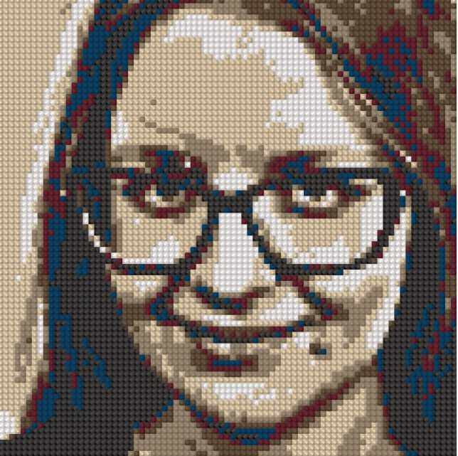
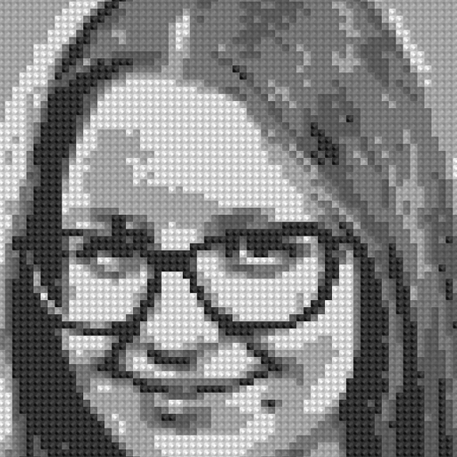
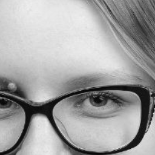
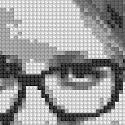

## Данные  

Для пробного обучения был выбран датасет ```facades``` просто из-за его размера.  

В качестве собственных данных был взят датасет фото/(алмазная) мозаика (это прикольная и хайповая штука, за которую сейчас надо платить деньги), состоящий из *116* фотографий и их мозаичных версий (*90* train + *26* test).
Я рассмотрела три варианта датасета (здесь приведены только два в силу их размера):  

1. ```diamonds``` — состоит из цветных фотографий и их ретро версий-мозаик. Модель очень плохо обучалась на данном датасете так как модель не могла из ретро версии правильно восстанавливать цвета.
   <p align="center">
       
   </p>
   <p align="center">
       
   </p>
2. ```diamonds_bw``` — состоит из черно-белых фотографий $646 \times 646$ и их чб версий-мозаик. Из-за предыдущего пункта было принято решение взять чб варианты фото и мозаик, так как так лучше сохраняется соотнощение яркости.
   <p align="center">
       
   </p>
   <p align="center">
       
   </p>
3. ```diamonds_bw_256``` — состоит из таких же изображений, что и предыдущий, но они обрезаны под размер $256 \times 256$. Взято из предположения, что так модели будет легче различить паттерны, когда они более выражены.
   <p align="center">
       
   </p>
   <p align="center">
       
   </p>

P.S. все данные собирались вручную с помощью беспощадного закликивания *qbrix* (очевидно, бесплатных его возможностей)...
